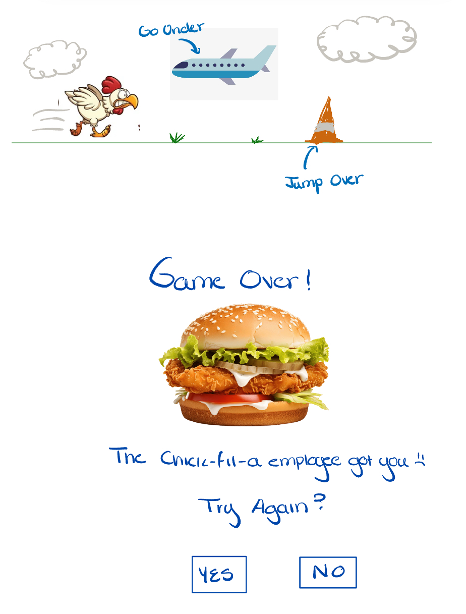

:warning: Everything between << >> needs to be replaced (remove << >> after replacing)

# << Chicken Chase >>
## CS110 Final Project  << Fall 2024 >>

## Team Members
Valeria Velez

***

## Project Description
You are a chicken, and you are trying to escape Chick-fil-a by running as far away as you can. You have to run away from the employee, dodging different obstacles to get as far away from the restaurant as you can.

***    

## GUI Design

### Initial Design

### Final Design

## Program Design

### Features

1. Jump
2. Scrolling Background 
3. Obstacle Collision
4. Game Over Screen
5. High Score

### Classes

- Chicken: This is the character the player plays as. The chicken is trying to run from a fast-food worker who is trying to make ythem into fried chicken.
- Background: the background is a green scenery with trees in hills that loops while the game is in session.
- Cone: This is one of the obstacles the player is faced with. Upon collison, the player will die.
- Cloud: This is a cosmetic aspect of the game that will be up in the sky. It will appear occasionally.
- Plane: This is an potential obstacle, where the player will have to duck or jump to dodge it. This is still a work in progress, and may not be implemented in the final project.

## ATP
### Test Case 1: Starting the Game
1. Open the game.
2. Press any key to start.
#### Expected Outcome: The chicken will start on the left side of the screen, and the background will start moving to the left in a loop.

### Test Case 2: Jump
1. Open the game. 
2. Start the game.
3. Press the spacebar.
#### Expected Outcome: The chicken will jump in response to the spacebar being pressed.

### Test Case 3: Movement
1. Open the game. 
2. Press any key to start.
3. Verify that the chicken's running animation is smooth and functioning.
4. Press the spacebar.
5. Verify that the jumping animation is smooth and functioning.
#### Expected Outcome: Upon starting the game, the chicken's movement is smooth and not rigid or messed up in any way.

### Test Case 4: Obstacle Collision
1. Open the game. 
2. Press any key to start.
3. Allow the chicken to run into a cone.
#### Expected Outcome: The chicken should play the dying animation, and the 'game over' screen should appear.

### Test Case 5: Try Again Button
1. Open the game.
2. Press any key to start.
3. Play the game as intended, until the chicken collides with an obstacle.
4. Click the try again button.
#### Expected Outcome: The game should start over again, and the player should be able to play another round again.

