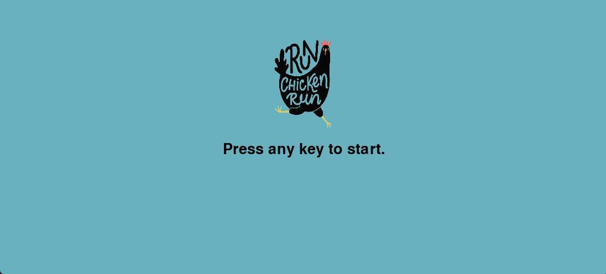
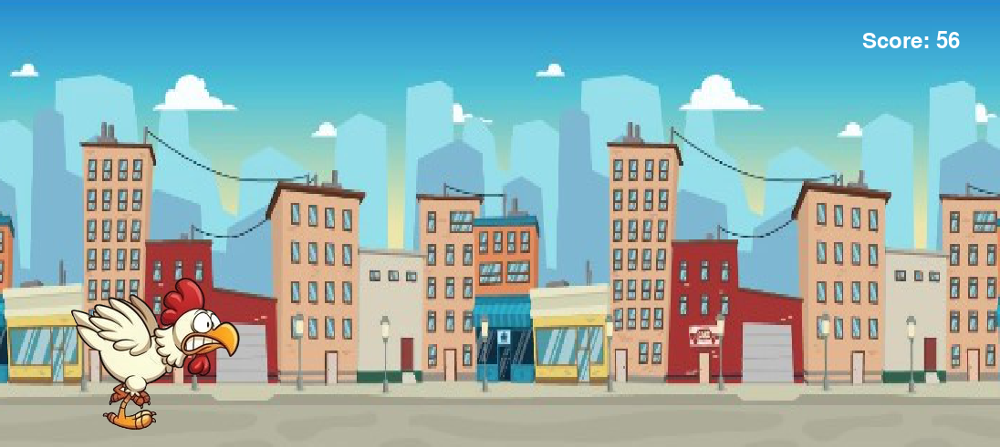
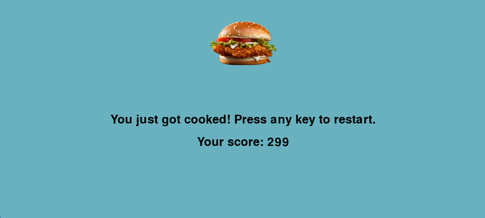

:warning: Everything between << >> needs to be replaced (remove << >> after replacing)

# Run Chicken, Run!
## CS110 Final Project  Fall 2024 

## Team Members
Valeria Velez

***

## Project Description
You are a chicken, and you are trying to escape Chick-fil-a by running as far away as you can. You have to run away from the employee, dodging different obstacles to get as far away from the restaurant as you can. Don't let them catch you, or you'll be cooked!

***    

## GUI Design

### Initial Design

### Final Design

## Program Design

### Features
1. Jump
2. Scrolling Background 
3. Obstacle Collision
4. Game Over Screen
5. High Score

### Classes

- Chicken: This is the character the player plays as. The chicken is trying to run from a fast-food worker who is trying to make ythem into fried chicken.
- Background: the background is a green scenery with trees in hills that loops while the game is in session.
- Obstacle: This is what the player has to dodge through jumping or ducking. They will appear as planes, and they will either fly close to the ground, or cones, which will appear close to the ground.
- Cloud: This is a cosmetic aspect of the game that will be up in the sky. It will appear occasionally.

## ATP
### Test Case 1: Starting the Game
| Step                 |Procedure             |Expected Results                   |
|----------------------|:--------------------:|----------------------------------:|
|  1.                | Run the program.  |Start screen appears and prompts user to press a key to start.  |
|  2.                  | Press an arrow key or any key on the keyboard to start the game.   | Starts the game, with the chicken to the left side fo the screen and the background moving to the left in a loop.
   |
#### Expected Outcome: The chicken will start on the left side of the screen, and the background will start moving to the left in a loop.

### Test Case 2: Jump
| Step                 |Procedure             |Expected Results                   |
|----------------------|:--------------------:|----------------------------------:|
|  1.                   | Run the program.  |The start screen appears and prompts the user to press any key to start.
|  2.                   | Start the game by pressing a key.   | Game begins with the chicken running and the background moving.      |
|  3.                  | Press the up arrow key.  |Chicken will perform the jump animation, jumping high and far enough to dodge the obstacles.  |
|
#### Expected Outcome: The chicken will jump in response to the up arrow key being pressed.

### Test Case 3: Movement
| Step                 |Procedure             |Expected Results                   |
|----------------------|:--------------------:|----------------------------------:|
|  1.                   | Run the program.  |The start screen appears and prompts the user to press any key to start.  |
|  2.                   | Start the game by pressing any key.   | Game begins.|
|  3.                   | Verify that the movement of the chicken's running animation is smooth.  |----------|
|  4.                   | Press the spacebar   | The chicken jumps.      |
|  5.                   | Verify that the jump animation for the chicken is smooth.  |----------  |
|
#### Expected Outcome: Upon starting the game, the chicken's movement is smooth and not rigid or messed up in any way.

### Test Case 4: Obstacle Collision
| Step                 |Procedure             |Expected Results                   |
|----------------------|:--------------------:|----------------------------------:|
|  1.                   |Start the program.  |Start screen appears.  |
|  2.                   | Press any key to start.   | Starts the game.      |
|  3.                   |Collide with an obstacle.  |Stops the game, the chicken death image appears, and the restart screen appears shortly afterwards.  |
|
#### Expected Outcome: The chicken should play the dying animation, and the 'game over' screen should appear.

### Test Case 5: Try Again Screen
| Step                 |Procedure             |Expected Results                   |
|----------------------|:--------------------:|----------------------------------:|
|  1.                   |Start the program.  |Start screen appears.  |
|  2.                   | Press any key to start.   | Starts the game.      |
|  3.                   |Play the game as intended until the chicken collides with an obstacle. |Restart screen appears, along with the score for the round. Prompts the player to press any key to try again.  |
|  4.                   | Press any key to start again.   | Starts the game, resetting the score.      |
|
#### Expected Outcome: The game should be able to play another round after losing the previous one by pressing a key when prompted. When the new round starts, the score should reset.

